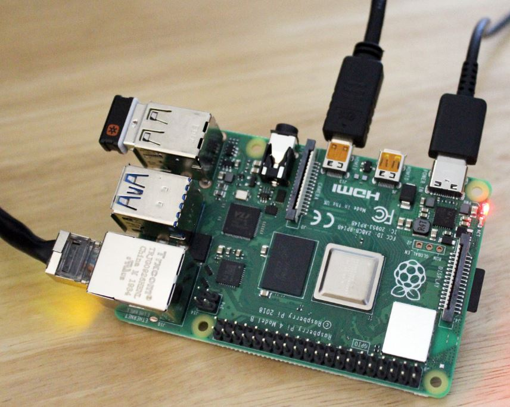
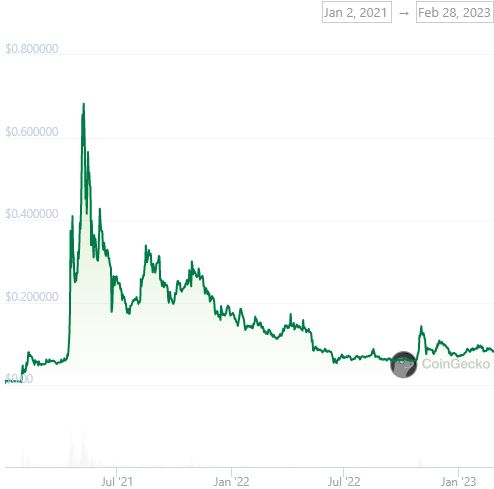

# Mine dogecoin with Raspberry Pi


## Tutorial on how to mine Dogecoin with a Raspberry Pi
This article explains how to set up a Raspberry Pi to mine Dogecoin, a popular cryptocurrency, using the open-source miner XMRig and the mining pool unMineable. 

Though not a profitable setup, the tutorial is a learning experience for those interested in cryptocurrency mining. 

The tutorial provides instructions for installing the miner on a Raspberry Pi and reminds users that the same process can be used on a bigger computer running any Linux distribution. 


### Requirements 📜

Before starting to mine Dogecoin using a Raspberry Pi, you need to fulfill three requirements. 

Firstly, it is recommended to use a recent model of Raspberry Pi that has a good CPU to obtain better results. 

Secondly, you require a 64-bit operating system to install the miner. 

Lastly, you need to connect the miner to the Dogecoin network using a mining pool. In the first part of the tutorial, the author will provide a detailed explanation of these three steps.

### Choose a Raspberry Pi model box 🤹‍♀️

Due to the absence of a GPU, Raspberry Pi miners are limited to the CPU, making Raspberry Pi 4/400 a better choice than older models. 

The mining process is usually done on powerful computers with multiple GPUs, but since Raspberry Pi doesn't have GPUs, we must rely on the CPU. 



Furthermore, a 64-bit operating system must be installed to proceed to the next step, making older models unsuitable for testing. 

The following models are the only ones that can be used for this tutorial: Raspberry Pi Zero 2, Raspberry Pi 2B (version 1.2 only), Raspberry Pi 3 or 3B+, Raspberry Pi 4 or 400.

### Install a 64 bits operating system 💻

To use the miner in this tutorial, a 64-bit operating system is required, and a recent Raspberry Pi model is recommended since it doesn't have a GPU. The miner is software that will connect to the cryptocurrency network and use the computer's resources to do the jobs given by the mining pool.

Installing a 64-bit operating system will provide better results, and the first step is to install a system on the Raspberry Pi. The Ubuntu Server is an easy option to install using Raspberry Pi Imager or download the beta version of Raspberry Pi OS 64 bits from their server. The lite version of Raspberry Pi OS 64 bits is enough as a graphic interface is not needed. Flash it on a SD card using Raspberry Pi Imager or Balena Etcher.

If you prefer to use Ubuntu or want to keep things simple, you can use Raspberry Pi Imager to flash the server version of Ubuntu. In the operating system choice, select "Other general-purpose OS" and then "Ubuntu". Choose the 64-bit server OS from the list and flash it on the SD card.

You can also use a 64-bit operating system Linux distribution like Fedora, Kali and Manjaro.

Boot your new installation. If you are using Raspberry Pi OS, you have the option to use `raspi-config` to set up the network or keyboard layout if necessary. You can do this by running the following command: 

```bash
sudo raspi-config
```
After configuring the necessary settings, it is advisable to update all packages to the latest version by running the command: 

```bash
sudo apt update
sudo apt full-upgrade
```

### Get a DOGE coin address 🤑

Although it may not be required by every mining pool, obtaining a DOGE address can be beneficial if you are committed to the process. This step becomes even more significant if you plan to test the mining on a computer other than your Pi. The official website provides instructions on how to obtain a DOGE address.

https://dogecoin.com/

### Choose a DOGE mining pool 🤽‍♂️

To mine Dogecoin on Raspberry Pi, you will need a mining pool, which is a group of miners who pool their resources together to increase the likelihood of finding a block and receiving a reward for their work. 

One such recommended pool is unMineable, which supports Xmrig, does not require an account, and charges a standard 1% fee.

To use unMineable as your mining pool, you need to visit their website, select Dogecoin from the list of coins, and choose the CPU option (RandomX). 

[https://unmineable.com/](https://unmineable.com/?ref=25zg-f6m7)

You will need to take note of the URL and port of the global server, which at the time of writing is `rx.unmineable.com:3333`, and set your user field accordingly. The format of your user is something like:

```
DOGE:<doge address>.<worker name>
```


a real-world example of a doge address:
```
DOGE:DHpRvHZhtr1b7wYciT3Kn7P9cX92WPrmi4.unmineable_worker_lwivgzo#5zvv-gkvv
```

### Build the XMRig miner 🔨
The first thing you need is to install XMRig on Raspberry Pi as follows:

```bash
sudo apt-get install git build-essential cmake libuv1-dev libssl-dev libhwloc-dev
```
Copy the XMRig source code from GitHub to your computer
```bash
git clone https://github.com/xmrig/xmrig.git
```

Create a folder to hold the XMRig miner executable
```bash
mkdir xmrig/build && cd xmrig/build
```

Build the miner executable
```bash
cmake ..
make -j$(nproc)
```

Wait the process to finish and you will get a file called xmrig, which is the miner executable. You will use it to mine DOGE coin.

### Configure the miner 🔧

Download the template from here:

```bash
https://raw.githubusercontent.com/xmrig/xmrig/master/src/config.json
```

Edit the config.json file with `vi` or `nano`

in this configuration file, replace the values in **url** and **user** fields, for example:

```json
"url": "rx.unmineable.com:3333",
"user": "DOGE:DHpRvHZhtr1b7wYciT3Kn7P9cX92WPrmi4.unmineable_worker_lwivgzo#5zvv-gkvv",
```
Save the changes `ESC`+ `:wq` in `vi` or `CTRL`+`X` in `nano`.


### Start the DOGE minert 🏃‍♀️

```bash
./xmrig
```

if everything is working you should see something statuses like the address, network speed, number of transactions.


To keep it running, install `screen` and run this command to execute the miner in the background.

```bash
screen -d -m -S unmineable ./xmrig
```

to check the output and see how the miner is going:

```bash
screen -r unmineable
```

Then `CTRL` + `A` + `D` to exit and keep it running.

### The future of DOGE 📈

The future of Dogecoin is uncertain and subject to volatility, as is the case with most cryptocurrencies. Some analysts believe that the current surge in Dogecoin's value is primarily driven by social media hype and speculation, rather than any fundamental value. This means that the price may be susceptible to significant fluctuations and that investors should exercise caution.

Others believe that the increasing mainstream acceptance of cryptocurrencies, coupled with Dogecoin's low transaction fees and speedy processing times, could lead to increased adoption and price appreciation. However, it's important to note that no one can predict the future of any cryptocurrency with certainty, and investors should do their own research and exercise caution before investing in any digital asset. 



### Conclusion 😊

On the platform, you can view your current DOGE coin balance and a record of your workers' recent outcomes. During my experiment with a Raspberry Pi 4, the hash rate averaged between 100 and 200 without any optimization. If you have other miners or apps running this could be reduced to 90 H/s.

However, if the speed begins to decrease, it is likely due to inadequate cooling. 

I have a proper cooling system, which is a metal box that dissipates Raspberry Pi heat.

My CPU is around 45° C - 50° C, but without this cooling, the CPU temperature can reach approximately 75° C, which will cause a slowdown.

If you plan to test for an extended period, consider overclocking your Raspberry Pi and installing a high-quality cooling system, a CPU fan or a Pi metal case to maintain low temperatures.

